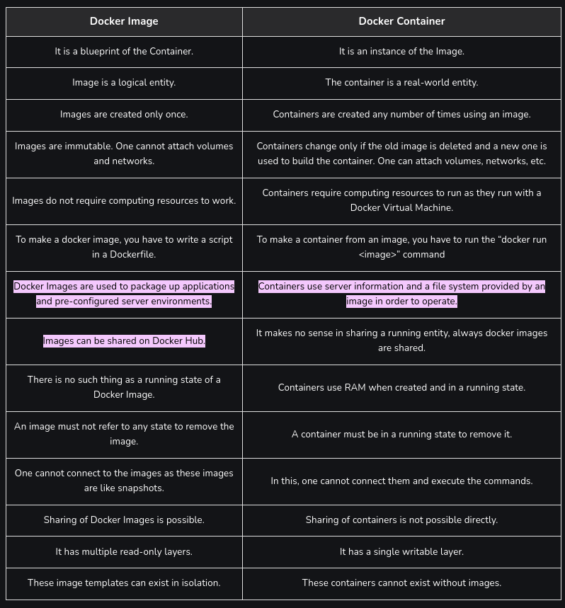
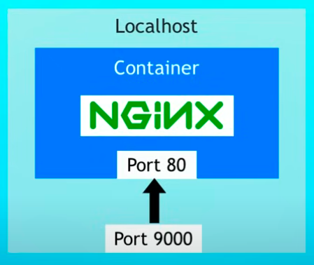
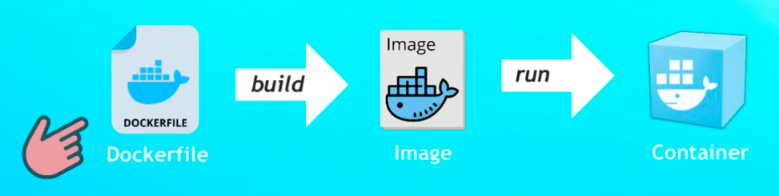

### What is Docker         
* Docker is a virtulaization software.           
* Makes developing and deploying applications much easier.             
* Packages application with all necessary dependencies, configuration, system tools and runtime.          
#### Development Before Containers      
* Before containers every developer needs to install all dependecies which cause complications such as -       
    * Installation process different for each OS enviroment.         
    * Many steps, which may cause errors. For example if a package requires 10 other depedencies then all the 10 packages will be required to be installed and configured in each computer of the development team which might cause issues as they may be using different versions of the package diffeent operating systems which might break the main application that is been developed.        
#### Deployment Before Containers            
* Before containers after development the developed application was deployed in a virtual machine created in the deployment server.             
* This causes the *OPS* team to maintain different virtual machines for different applications and install different dependencies manually.             
* For virtual machines resources are set where for example if 8 GB RAM is seperated for VM-1 VM-2 cannot use VM-1s RAM even if VM-1 is not using the allocated RAM. (no elasticity)       
* VM's are also slow during startup compared to Containers.                
        
#### Docker Image vs Container

* The realationship between a *Docker* image and a container is similar to the realtionship between a class and a object of that class.          
* Where the image is like a blue print describing how the container should be created.     
               

#### Docker Registry              
* A Docker registry is a centralized repository where Docker images are stored, managed, and distributed. It functions similarly to a code repository but is specifically designed for Docker images. Registries allow users to share and distribute container images, facilitating collaboration and efficient deployment of applications.              
* Docker Hub is the default and most widely used public Docker registry. It hosts millions of Docker images, including official images maintained by Docker and community-contributed images.          
* A private registry is used to store private Docker images all cloud services have there own Registry and Docker Hub too has its private registry.           
* Inside a private registory different versions of images can be saved inside a repositories.               
* AWS private registry for storing images - *AWS ECR*                             
#### Port Bindings            
* Applications inside a containor runs inside a isolated network since they are not accesible by the host server or computer.           
* Port bindings are used to expose containers to the host.              
* **docker run -d -p 9000:80**     
                  
#### Dockerfile - Build Instruction        
* In addition to Docker images in Docker registry we migh need to make out own Docker images to deploy out own applications.                
* A *Dockerfile* can be added to a project which includes the instructions to build a Docker image.           
                  
* Dockerfile commads - 
    * **FROM {base image name}**- specifies the base image used to build the new image                   
    * **WORKDIR {path}**- creares or charges the current directory inside the container to the directory specified                 
    * **COPY {path 1} {path 2}** - copies files or folders from the local host specified by *path 1* inside to a location inside the container specified by *path 2*                          
    * **RUN {command}** - linux commands can be specified to be runned inside the containor using the *RUN* command                  
    * **ENV {name} {value}** - is used to define an enviroment variable with the name specified by the *name* variable and value specified by the *value*               
    * **EXPOSE {port number}** - is used to expose a port of the conatinor tho the host if needed            
    * **CMD ["executable", "param 1", "param 2"]** - the commands that runs when the container is started               
#### Docker Commands            
1. **docker images** - will give the list images in the current system                    
2. **docker ps** - will give the list of active containers                 
3. **docker ps -a** - will give a list of all containers that are active and closed                              
3. **docker pull {name}:{tag}** - can be used to pull a Docker image. 
    * {name} - name of the package       
    * {tag}(optional) - version of the package if not specified *latest* version will be pulled               
4. **docker run {image}:{tag}** - will run the image as a container      
    * name - name of image        
    * tag (optional)- version                    
5. **docker run -d {name}:{tag}** - runs the container in detached mode, will not block the command line with logs                      
6. **docker run -d -p {HOST_PORT}:{CONTAINER_PORT} {name}{tag}** - run a container in detached mode where port of the container specified by the variable 'CONTAINER_PORT' is exposed to the host port specified by the variable 'HOST_PORT'                   
7. **docker stop {containor id}** - used to stop the containor specified by the variable connector id                   
8. **docker logs {containor id}** - can be used to see log of a running contianer              
9. **docker start {containor id}** - can be used to start a stopped containor (docker run - will always create a new containor where as docker start will start a containor that was already created and was stopeed)                     
10. **docker run --name {custom name} -d -p {HOST_PORT}:{CONTAINER_PORT} {name}{tag}** -  a custom name can be specified when a new containor is created this name can be used instead of the containor id when calling commands such as stop, logs, start etc...                    
11. **docker exec -it <container_id_or_name> /bin/bash** - is used to acsess the command line inside the container         
12. **docker build -t {name}:{tag} {path}** - buid a Docker image with the given name and tag according to the contect of the folder specified by the path                    

